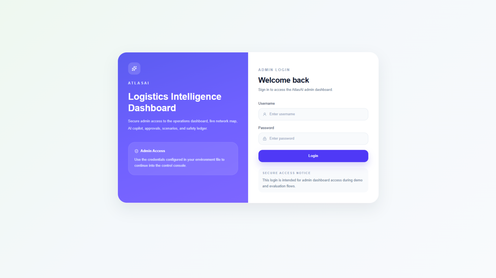
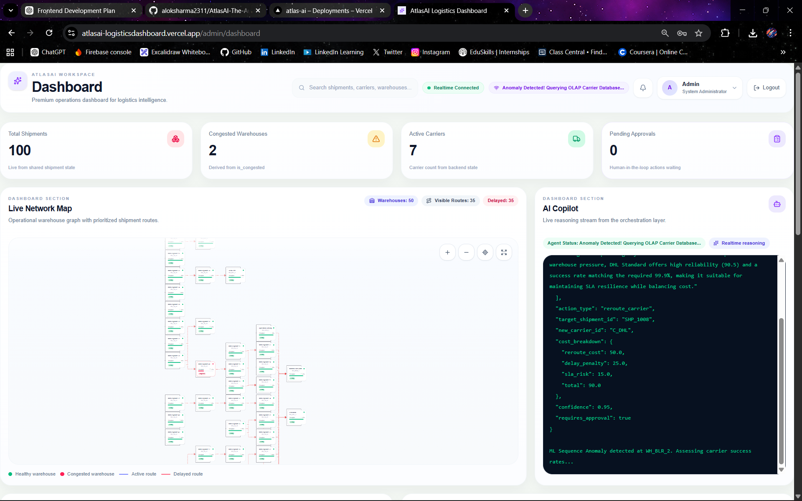
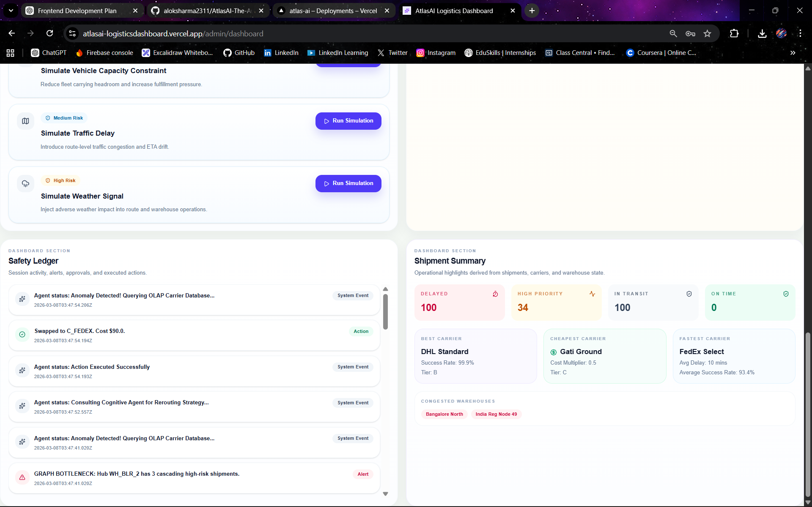
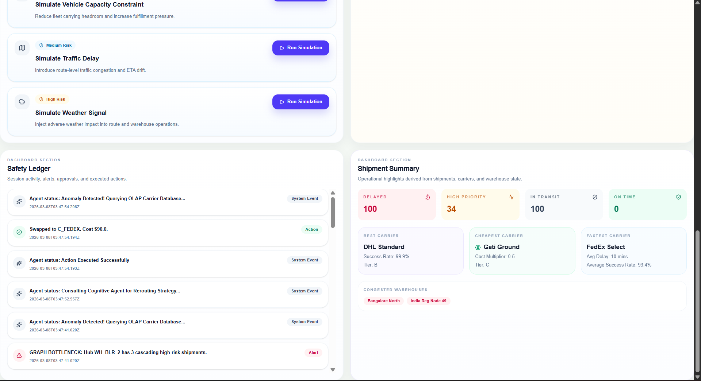

# AtlasAI

### The Autonomous Intelligence Layer for Logistics

<div align="center">

AI-powered Logistics Control Tower implementing a full
**Observe → Reason → Decide → Act → Learn** agentic loop.

Built for the **Taqneeq Hackathon – Agentic AI for Supply Chain**

</div>

---

# Demo Preview

## Login Interface



Secure admin access to the AtlasAI control tower.

Features:

• authentication gate for operations console
• modern UI built with Next.js + Tailwind
• responsive design

---

## Operations Control Tower

### Dashboard View



The AtlasAI dashboard provides a **real-time operational command center** for logistics networks.

Key components visible here:

• shipment network visualization
• AI Copilot reasoning stream
• live warehouse throughput monitoring
• scenario simulation controls

---

### AI Decision & Monitoring Interface





The dashboard enables operators to:

• monitor shipment risks
• approve AI actions
• trigger simulation scenarios
• review safety logs

---

# Overview

Modern logistics disruptions rarely occur as single failures.

They emerge gradually from **small operational signals**:

• warehouse congestion
• delayed pickups
• carrier degradation
• traffic delays
• weather disruptions
• cascading reroutes

Traditional systems only **report problems after they happen**.

AtlasAI introduces an **intelligent operational layer** that continuously:

```
Observe → Reason → Decide → Act → Learn
```

The system identifies risks early and intervenes before SLA breaches occur.

---

# Core Architecture

AtlasAI implements a complete **agentic intelligence pipeline**.

```
Simulation Engine
        ↓
Observe Layer
        ↓
ML Perception Layer
        ↓
LLM Cognitive Agent
        ↓
Safety Guardrails
        ↓
Execution Layer
        ↓
Learning Feedback Loop
```

Unlike typical AI demos, AtlasAI combines **machine learning, reasoning agents, and operational safety controls**.

---

# Observe — Real-Time Operational Awareness

AtlasAI continuously monitors a simulated logistics network:

• **50 warehouses**
• **100 shipments**
• multiple carrier partners

Operational signals include:

• shipment states
• ETAs
• warehouse throughput
• carrier reliability
• pickup delays
• inventory levels
• vehicle capacity
• traffic delays
• weather disruptions

The backend simulation updates every **15 seconds**.

---

# Data Architecture

AtlasAI uses a **dual-database architecture** optimized for speed and analytics.

### Live Operational Database

```
SQLite
live_state.db
```

Stores:

• real-time shipment states
• warehouse throughput
• carrier assignments

Chosen for **fast operational queries**.

---

### Analytical Warehouse

```
DuckDB
olap_warehouse.duckdb
```

Stores:

• carrier performance history
• anomaly events
• decision outcomes
• reinforcement feedback

DuckDB powers **analytical reasoning queries**.

---

# Reason — Machine Learning Perception

Before invoking the AI agent, AtlasAI runs a **machine learning perception layer**.

This converts raw operational signals into **structured intelligence**.

---

## Shipment Delay Prediction

A **RandomForestRegressor** predicts delay probability using:

• warehouse congestion
• traffic conditions
• pickup delays
• carrier reliability

Each shipment receives a live:

```
risk_score: 0.0 → 1.0
```

This represents the probability of SLA breach.

---

## Carrier Reliability Scoring

Carrier reliability is dynamically calculated based on:

• historical success rate
• delivery latency
• SLA breaches

The resulting:

```
reliability_score
```

guides the agent in selecting better partners.

---

## Watchtower — Anomaly Detection

AtlasAI includes a monitoring AI called **Watchtower**.

Using **Isolation Forest**, it detects abnormal warehouse behavior.

Example detection:

```
Warehouse WH_MUM throughput dropped by 45%
```

This triggers an alert and activates the cognitive agent.

---

# Decide — Cognitive AI Agent

Once a disruption is detected, the system activates the **LLM decision agent**.

The agent receives context including:

• affected shipments
• warehouse metrics
• carrier reliability
• predicted delay risks

Example decision output:

```json
{
  "action_type": "reroute_shipment",
  "estimated_cost": 34,
  "confidence": 0.82,
  "reasoning": [
    "Warehouse congestion detected",
    "Carrier reliability degraded",
    "Shipment risk of SLA breach"
  ]
}
```

The reasoning stream appears in the **AI Copilot panel** in real time.

---

# Act — Safe Execution

AtlasAI enforces strict **AI safety guardrails**.

### Autonomous Actions

Low-risk actions are executed automatically.

Examples:

• rerouting shipments
• switching carriers
• adjusting routing priorities

Condition:

```
estimated_cost < $50
```

---

### Human Approval Layer

High-impact decisions require operator approval.

The system pushes proposals to the **Approval Queue**.

Operators can:

• approve
• reject

All actions are logged in the **Safety Ledger**.

---

# Learn — Continuous Feedback Loop

AtlasAI evaluates outcomes of past decisions.

When an action is executed:

```
Audit ID logged to DuckDB
```

After **30 simulated minutes**, the system evaluates:

• delivery success
• SLA impact
• carrier performance

If a carrier fails again, its reliability score is penalized.

The system gradually **learns to avoid poor carriers**.

---

# Simulation Scenarios

The dashboard allows controlled disruption testing.

Available scenarios include:

• Mumbai Monsoon
• Pickup Delay
• Inventory Pressure
• Vehicle Capacity Constraint
• Traffic Congestion
• Weather Disruption

These scenarios demonstrate the agent’s **real-time reasoning capabilities**.

---

# Tech Stack

### Backend

Python
FastAPI
SQLite
DuckDB
Scikit-Learn
OpenAI / LLM agent

---

### Frontend

Next.js
React
TypeScript
TailwindCSS
Zustand
ReactFlow

---

### Infrastructure

WebSockets
REST APIs
Vercel Deployment

---

# Running the Project

### Install dependencies

```
npm install
```

### Start frontend

```
npm run dev
```

### Run backend simulation

```
python engine.py
```

---

# Environment Variables

Create `.env.local`:

```
NEXT_PUBLIC_API_URL=
NEXT_PUBLIC_SOCKET_URL=
NEXT_PUBLIC_ADMIN_USERNAME=
NEXT_PUBLIC_ADMIN_PASSWORD=
```

---

# Deployment

The frontend is deployed on **Vercel**.

Steps:

1. Push repository to GitHub
2. Import project into Vercel
3. Configure environment variables
4. Deploy

---

# Final Note

AtlasAI is not a simple chatbot or analytics dashboard.

It is a **complete agentic intelligence system** implementing:

```
Observe → Reason → Decide → Act → Learn
```

for modern logistics operations.

---